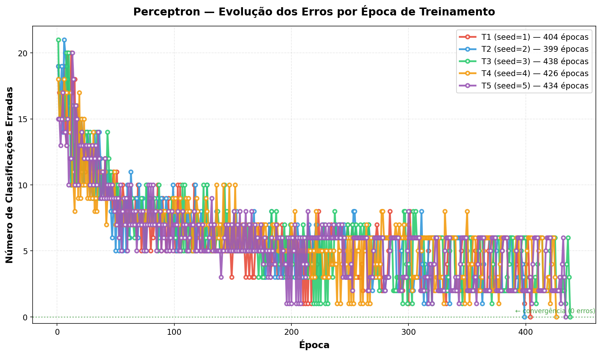
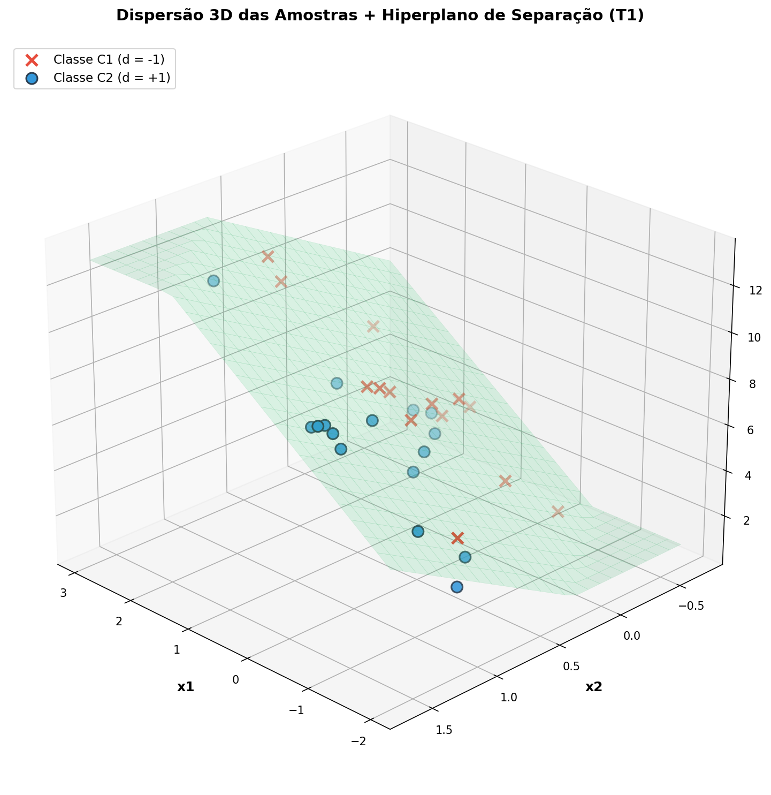
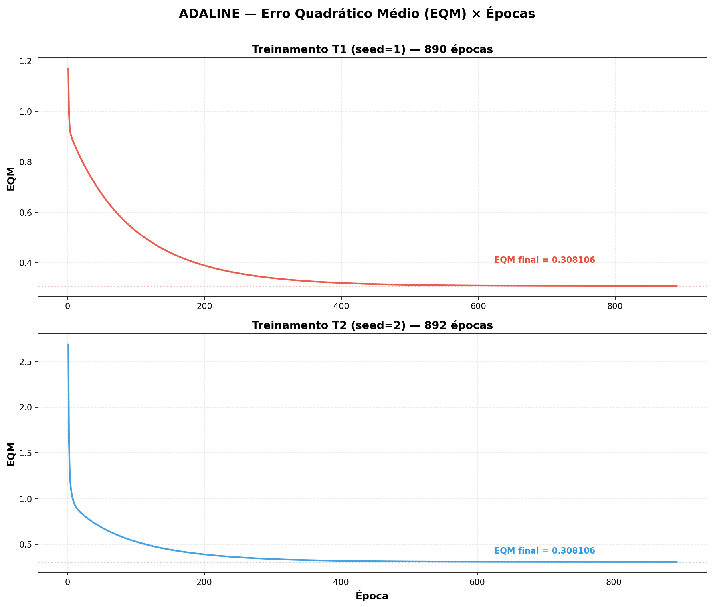
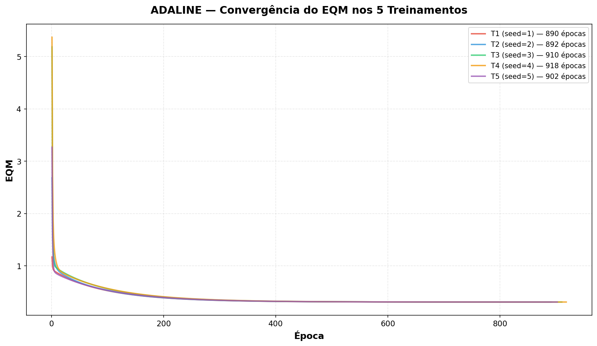

<p align="center">
  
</p>

<p align="center">
  
  
  
  
</p>

<p align="center">
  <em>Implementação de redes neurais de camada única para classificação de padrões</em>
</p>


## 📖 Sobre o Projeto

Este repositório contém a implementação de duas redes neurais artificiais clássicas — **Perceptron** e **ADALINE** — desenvolvidas para a disciplina de **Laboratório de Inteligência Artificial** do CEFET-MG Campus VIII (Varginha), ministrada pelo Prof. Lázaro Eduardo da Silva.

Ambas as redes são de **camada única** e servem como base para entender os fundamentos de redes neurais, incluindo aprendizado supervisionado, funções de ativação e critérios de convergência.


## ⚡ Perceptron — Classificação de Pureza de Óleo

### O Problema

A partir da análise de um processo de **destilação fracionada de petróleo**, é necessário classificar amostras de óleo em duas classes de pureza (**C1** e **C2**) baseando-se em três propriedades físico-químicas.

### Arquitetura

```
  x₀ = -1 ──(w₀)──┐
  x₁ ──────(w₁)────┤
  x₂ ──────(w₂)────┼──► Σ ──► g(.) ──► y
  x₃ ──────(w₃)────┘        degrau
                             bipolar
```

### Configurações

| Parâmetro | Valor |
|:---------:|:-----:|
| Taxa de aprendizagem (η) | `0.01` |
| Função de ativação | Degrau Bipolar |
| Bias (x₀) | `-1` |
| Regra de aprendizado | Regra de Hebb |
| Critério de parada | Erro = 0 na época |
| Máx. épocas | `1000` |

### Resultados

<details>
<summary>📊 <b>Tabela de Treinamentos (clique para expandir)</b></summary>

<br>

| Treino | w₀ inicial | w₁ inicial | w₂ inicial | w₃ inicial | w₀ final | w₁ final | w₂ final | w₃ final | Épocas |
|:------:|:----------:|:----------:|:----------:|:----------:|:--------:|:--------:|:--------:|:--------:|:------:|
| T1 | 0.4170 | 0.7203 | 0.0001 | 0.3023 | -3.1030 | 1.5733 | 2.5022 | -0.7393 | **404** |
| T2 | 0.4360 | 0.0259 | 0.5497 | 0.4353 | -3.0440 | 1.4792 | 2.4785 | -0.7272 | **399** |
| T3 | 0.5508 | 0.7081 | 0.2909 | 0.5108 | -3.1292 | 1.5771 | 2.5154 | -0.7440 | **438** |
| T4 | 0.9670 | 0.5472 | 0.9727 | 0.7148 | -3.0530 | 1.5299 | 2.4721 | -0.7284 | **426** |
| T5 | 0.2220 | 0.8707 | 0.2067 | 0.9186 | -3.1580 | 1.5962 | 2.5345 | -0.7505 | **434** |

> 💡 **Observação:** Os pesos finais são *semelhantes* mas **não idênticos** — o Perceptron encontra qualquer hiperplano válido, não necessariamente o mesmo.

</details>

<details>
<summary>🎯 <b>Classificação das Amostras de Teste (clique para expandir)</b></summary>

<br>

| Amostra | x₁ | x₂ | x₃ | T1 | T2 | T3 | T4 | T5 |
|:-------:|:---:|:---:|:---:|:--:|:--:|:--:|:--:|:--:|
| 1 | -0.3565 | 0.0620 | 5.9891 | C1 | C1 | C1 | C1 | C1 |
| 2 | -0.7842 | 1.1267 | 5.5912 | C2 | C2 | C2 | C2 | C2 |
| 3 | 0.3012 | 0.5611 | 5.8234 | C2 | C2 | C2 | C2 | C2 |
| 4 | 0.7757 | 1.0648 | 8.0677 | C2 | C2 | C2 | C2 | C2 |
| 5 | 0.1570 | 0.8028 | 6.3040 | C2 | C2 | C2 | C2 | C2 |
| 6 | -0.7014 | 1.0316 | 3.6005 | C2 | C2 | C2 | C2 | C2 |
| 7 | 0.3748 | 0.1536 | 6.1537 | C1 | C1 | C1 | C1 | C1 |
| 8 | -0.6920 | 0.9404 | 4.4058 | C2 | C2 | C2 | C2 | C2 |
| 9 | -1.3970 | 0.7141 | 4.9263 | C1 | C1 | C1 | C1 | C1 |
| 10 | -1.8842 | -0.2805 | 1.2548 | C1 | C1 | C1 | C1 | C1 |

> ✅ **100% de unanimidade** — todos os 5 treinamentos concordam em todas as amostras.

</details>

### Visualizações

<p align="center">
  
</p>

<p align="center"><em>Evolução do número de classificações erradas por época nos 5 treinamentos</em></p>

<p align="center">
  
</p>

<p align="center"><em>Dispersão 3D das amostras com o hiperplano de separação encontrado</em></p>


## 🔬 ADALINE — Classificação de Sinais (Válvulas A/B)

### O Problema

Um sistema industrial envia sinais codificados com **4 grandezas** para acionar duas válvulas. Os sinais sofrem interferência durante a transmissão, e a rede ADALINE precisa classificar corretamente se o sinal deve ir para a **Válvula A** ou **Válvula B**.

### Arquitetura

```
  x₀ = -1 ──(w₀)──┐
  x₁ ──────(w₁)────┤
  x₂ ──────(w₂)────┼──► Σ ──► u ──► g(.) ──► y
  x₃ ──────(w₃)────┤         ↑
  x₄ ──────(w₄)────┘         │
                              └──── d  (erro = d - u)
                              ANTES da ativação!
```

### Configurações

| Parâmetro | Valor |
|:---------:|:-----:|
| Taxa de aprendizagem (η) | `0.0025` |
| Precisão (ε) | `10⁻⁶` |
| Função de ativação | Degrau Bipolar (somente na operação) |
| Regra de aprendizado | Regra Delta (LMS) |
| Critério de parada | \|ΔEQM\| ≤ ε |

### Resultados

<details>
<summary>📊 <b>Tabela de Treinamentos (clique para expandir)</b></summary>

<br>

| Treino | w₀ final | w₁ final | w₂ final | w₃ final | w₄ final | Épocas |
|:------:|:--------:|:--------:|:--------:|:--------:|:--------:|:------:|
| T1 | -1.8113 | 1.3125 | 1.6414 | -0.4264 | -1.1771 | **890** |
| T2 | -1.8113 | 1.3126 | 1.6414 | -0.4264 | -1.1771 | **892** |
| T3 | -1.8113 | 1.3126 | 1.6414 | -0.4264 | -1.1771 | **910** |
| T4 | -1.8113 | 1.3126 | 1.6415 | -0.4263 | -1.1772 | **918** |
| T5 | -1.8113 | 1.3126 | 1.6414 | -0.4263 | -1.1772 | **902** |

> 💡 **Observação:** Os pesos finais são **praticamente idênticos** (variação < 0.0002) — a Adaline converge para a **solução única** do mínimo global.

</details>

<details>
<summary>🎯 <b>Classificação das Amostras de Teste (clique para expandir)</b></summary>

<br>

| Amostra | x₁ | x₂ | x₃ | x₄ | T1 | T2 | T3 | T4 | T5 |
|:-------:|:---:|:---:|:---:|:---:|:--:|:--:|:--:|:--:|:--:|
| 1 | 0.9694 | 0.6909 | 0.4334 | 3.4965 | A | A | A | A | A |
| 2 | 0.5427 | 1.3832 | 0.6390 | 4.0352 | A | A | A | A | A |
| 3 | 0.6081 | -0.9196 | 0.5925 | 0.1016 | B | B | B | B | B |
| 4 | -0.1618 | 0.4694 | 0.2030 | 3.0117 | A | A | A | A | A |
| 5 | 0.1870 | -0.2578 | 0.6124 | 1.7749 | A | A | A | A | A |
| 6 | 0.4891 | -0.5276 | 0.4378 | 0.6439 | B | B | B | B | B |
| 7 | 0.3777 | 2.0149 | 0.7423 | 3.3932 | B | B | B | B | B |
| 8 | 1.1498 | -0.4067 | 0.2469 | 1.5866 | B | B | B | B | B |
| 9 | 0.9325 | 1.0950 | 1.0359 | 3.3591 | B | B | B | B | B |
| 10 | 0.5060 | 1.3317 | 0.9222 | 3.7174 | A | A | A | A | A |
| 11 | 0.0497 | -2.0656 | 0.6124 | -0.6585 | A | A | A | A | A |
| 12 | 0.4004 | 3.5369 | 0.9766 | 5.3532 | B | B | B | B | B |
| 13 | -0.1874 | 1.3343 | 0.5374 | 3.2189 | A | A | A | A | A |
| 14 | 0.5060 | 1.3317 | 0.9222 | 3.7174 | A | A | A | A | A |
| 15 | 1.6375 | -0.7911 | 0.7537 | 0.5515 | B | B | B | B | B |

> ✅ **100% de unanimidade** — resultado esperado, já que a Adaline converge para a mesma solução.

</details>

### Visualizações

<p align="center">
  
</p>

<p align="center"><em>Curvas de EQM × Épocas para os treinamentos T1 e T2</em></p>

<p align="center">
  
</p>

<p align="center"><em>Convergência dos 5 treinamentos para o mesmo valor de EQM — mínimo global único</em></p>


## ⚡ Perceptron vs ADALINE — Comparativo

<table>
<tr>
<th align="center">Característica</th>
<th align="center">🟡 Perceptron</th>
<th align="center">🔵 ADALINE</th>
</tr>
<tr>
<td align="center"><b>Autor</b></td>
<td align="center">Frank Rosenblatt (1958)</td>
<td align="center">Widrow & Hoff (1960)</td>
</tr>
<tr>
<td align="center"><b>Extração do erro</b></td>
<td align="center">Após ativação (<code>e = d − y</code>)</td>
<td align="center">Antes da ativação (<code>e = d − u</code>)</td>
</tr>
<tr>
<td align="center"><b>Regra de aprendizado</b></td>
<td align="center">Regra de Hebb</td>
<td align="center">Regra Delta (LMS)</td>
</tr>
<tr>
<td align="center"><b>Superfície de erro</b></td>
<td align="center">Descontínua / discreta</td>
<td align="center">Parabólica (mínimo global único)</td>
</tr>
<tr>
<td align="center"><b>Posição da fronteira</b></td>
<td align="center">Qualquer reta válida</td>
<td align="center">Centro da região de separação</td>
</tr>
<tr>
<td align="center"><b>Pesos finais</b></td>
<td align="center">Variam com inicialização</td>
<td align="center"><b>Únicos</b> para a mesma base</td>
</tr>
<tr>
<td align="center"><b>Critério de parada</b></td>
<td align="center">Erro = 0 na época</td>
<td align="center">|ΔEQM| ≤ ε</td>
</tr>
<tr>
<td align="center"><b>Robustez</b></td>
<td align="center">Menor</td>
<td align="center"><b>Maior</b> (equidistante das classes)</td>
</tr>
</table>


## 📁 Estrutura do Projeto

```
perc_ada/
├── 📂 atividades/                  # Materiais do professor
│   ├── Perceptron.pdf              # Enunciado do Perceptron
│   ├── Adaline.pdf                 # Enunciado da Adaline
│   └── oleo_dataset.csv            # Dataset de treinamento (Perceptron)
│
├── 📂 perceptron/                  # Implementação do Perceptron
│   ├── perceptron.py               # Código principal
│   └── resultados/                 # Gráficos e relatório gerados
│       ├── evolucao_erros.png
│       ├── dispersao_3d.png
│       ├── classificacao_teste.png
│       └── relatorio.txt
│
├── 📂 adaline/                     # Implementação da ADALINE
│   ├── adaline.py                  # Código principal
│   └── resultados/                 # Gráficos e relatório gerados
│       ├── eqm_treinamentos.png
│       ├── eqm_todos_treinamentos.png
│       ├── classificacao_teste.png
│       └── relatorio.txt
│
├── 📂 assets/                      # Imagens do README
└── README.md                       # Este arquivo
```


## 🚀 Como Executar

```bash
# Clonar o repositório
git clone https://github.com/SEU_USUARIO/perc_ada.git
cd perc_ada

# Executar o Perceptron
python3 perceptron/perceptron.py

# Executar a Adaline
python3 adaline/adaline.py
```

### Dependências

```bash
pip install numpy matplotlib
```


## 📝 Respostas Teóricas

<details>
<summary>❓ <b>Por que o número de épocas varia no Perceptron?</b></summary>

<br>

Os pesos iniciais são **aleatórios** e diferentes a cada treinamento. Eles definem o **ponto de partida** no espaço de busca. Pesos mais próximos da solução convergem em menos épocas; mais distantes precisam de mais. É como procurar a saída de um labirinto partindo de posições diferentes.

O **Teorema da Convergência do Perceptron** garante que, para dados linearmente separáveis, o algoritmo **sempre converge** — mas não diz em quantas épocas.

</details>

<details>
<summary>❓ <b>Qual a principal limitação do Perceptron?</b></summary>

<br>

O Perceptron **só classifica padrões linearmente separáveis** — ou seja, deve existir um hiperplano que separe perfeitamente as duas classes. O exemplo clássico de falha é o **problema XOR**, onde nenhuma linha reta consegue separar as classes. Para resolver isso, são necessárias redes **multicamadas (MLP)**.

</details>

<details>
<summary>❓ <b>Por que os pesos finais da Adaline são praticamente iguais?</b></summary>

<br>

A Adaline minimiza o **Erro Quadrático Médio (EQM)** usando **Gradiente Descendente**. A função de custo é **quadrática** nos pesos, formando uma superfície **parabólica** com um **único mínimo global**. Não importa de onde se parte (pesos iniciais), o gradiente sempre conduz ao **mesmo ponto de mínimo**. O número de épocas varia porque os caminhos têm comprimentos diferentes, mas todos chegam ao mesmo destino.

</details>


<p align="center">
  
</p>
